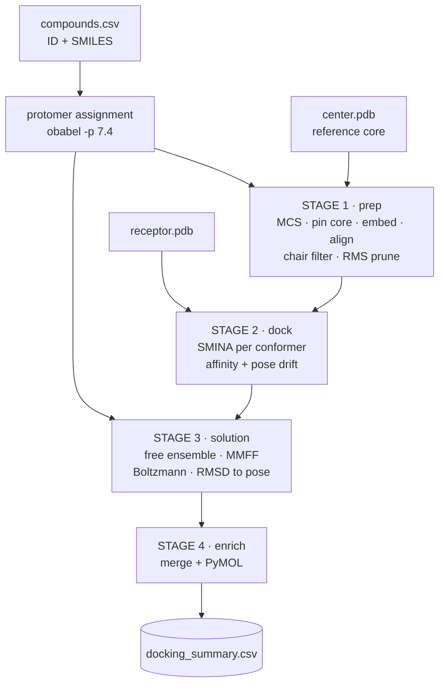

# Constrained SMINA Docking

A four-stage pipeline that docks analogues while pinning a shared substructure to the coordinates of a known reference ligand, then measures how much conformational strain the bound pose costs.

It exists because unconstrained docking fails on the target it ships with — not marginally, and not for a reason more compute can fix.


---

# Part 1 — Where free SMINA docking fails

## The test case

Everything below uses the bundled example: **CXCR4 in complex with the antagonist AMD070 (mavorixafor)**, cryo-EM structure [8ZPM](https://www.rcsb.org/structure/8ZPM) at 3.2 Å. The ligand's position is experimentally determined, so docking has a right answer to be measured against.

```
examples/cxcr4/receptor.pdb    CXCR4, chain R, residues 34-315 (2292 atoms)
examples/cxcr4/center.pdb      mavorixafor as resolved (26 atoms)
examples/cxcr4/analog.sdf      an ethyl analogue of mavorixafor (28 atoms)
examples/cxcr4/8ZPM.cif        the deposited structure, for provenance
```

The obvious question to ask before trusting any docking campaign: **can SMINA find a pose it has already been shown?**

## It cannot

`redock_control.py` docks the reference ligand freely — a full search, in the same box the constrained pipeline uses, from a randomised starting conformer — and compares the result to the experimental pose. Five independent seeds at exhaustiveness 16:

| Seed | Affinity (kcal/mol) | RMSD to experimental pose | Centroid shift |
|---|---|---|---|
| 1 | −7.600 | 7.15 Å | 2.62 Å |
| 2 | −8.000 | 4.88 Å | 2.07 Å |
| 3 | −8.500 | 4.62 Å | 2.01 Å |
| 4 | −7.900 | 5.23 Å | 1.75 Å |
| 5 | −7.300 | 6.61 Å | 2.34 Å |

**Zero of five runs came within 2 Å**, the conventional threshold for a successful redocking. The best attempt missed by 4.62 Å.

The centroid shift is only ~2 Å, so the ligand is not wandering out of the pocket. It sits in the right site in the wrong orientation — the classic failure mode, and the one that produces confident, plausible, wrong answers.

## Three controls, to rule out the boring explanations

A failed redocking usually means the search was too shallow or the ligand was set up badly. Both are testable, and `redock_control.py` tests them automatically.

**Control 1 — sampling.** Rerun at 4× exhaustiveness (64):

| | best | median | worst | recovered |
|---|---|---|---|---|
| exhaustiveness 16 | 4.62 Å | 5.23 Å | 7.15 Å | 0/5 |
| exhaustiveness 64 | 4.74 Å | 4.88 Å | 7.17 Å | 0/3 |

No improvement. Quadrupling the search budget moves the answer by ~0.1 Å.

**Control 2 — protonation.** Mavorixafor is a polyamine and carries +2 at pH 7.4. Rerun with the neutral species in case the charge assignment is the problem:

| | best | median | worst | recovered |
|---|---|---|---|---|
| +2 dication | 4.62 Å | 5.23 Å | 7.15 Å | 0/5 |
| neutral | 4.60 Å | 4.61 Å | 6.90 Å | 0/3 |

No improvement. Not a setup artefact.

**Control 3 — scoring.** Score the experimental pose directly and compare it to what free docking produced:

| | Affinity |
|---|---|
| Experimental pose, `--score_only` | −6.575 |
| Experimental pose, locally minimised | −6.988 |
| **Best free-docking pose (4.62 Å wrong)** | **−8.500** |

This is the answer. SMINA ranks its own incorrect pose **1.5 kcal/mol better** than the experimentally determined one — even after giving the experimental pose local relaxation, which is the fairer comparison.

The search is not failing. It is succeeding, at optimising a function whose minimum is in the wrong place. **No amount of exhaustiveness can fix a scoring failure**, which is exactly what the sampling control demonstrated.

## Why the scoring function misses it

Mavorixafor binds CXCR4 through salt bridges. Measured directly from `receptor.pdb`:

```
Asp97  OD2  ····  ligand N3    2.73 Å
Glu296 OE2  ····  ligand N5    2.62 Å
Glu296 OE2  ····  ligand N1    3.01 Å
```

Two acidic residues clamping a dication at 2.6–2.7 Å. That interaction is what defines the binding mode.

Now look at the scoring terms SMINA prints on every single run:

```
Weights      Terms
-0.035579    gauss(o=0,_w=0.5,_c=8)
-0.005156    gauss(o=3,_w=2,_c=8)
 0.840245    repulsion(o=0,_c=8)
-0.035069    hydrophobic(g=0.5,_b=1.5,_c=8)
-0.587439    non_dir_h_bond(g=-0.7,_b=0,_c=8)
 1.923       num_tors_div
```

Steric, hydrophobic, a non-directional hydrogen-bond term, and a torsion penalty. **There is no electrostatic term.** The interaction that anchors this ligand is invisible to the function being optimised, so the optimiser has no reason to reproduce it.

Two further observations fall out of the same limitation, both measured:

- **Ligand charge state barely moves the score.** Neutral and +2 forms of the same ligand, on identical coordinates, score −5.685 and −5.723 — a 0.04 kcal/mol difference.
- **Receptor hydrogens do nothing at all.** Adding 2365 hydrogens with `obabel -h -p 7.4` changed the affinity by *exactly zero*, to five decimal places. You do not need to protonate the receptor for SMINA.

This is a documented property of Vina-family scoring, not a defect in SMINA's implementation. It bites hardest where charged ligands meet acidic pockets — which is a large fraction of real medicinal chemistry.

## What that implies

If the scoring function cannot recover a binding mode you already know, then any affinity it produces for a *related* ligand is being measured in the wrong pose. The fix is not a better search. It is to stop asking the docking engine to determine the binding mode, and instead supply it.

That is what this pipeline does.

> **Run this on your own target before trusting anything.**
> ```bash
> python redock_control.py -r receptor.pdb -C center.pdb --reference-sdf ligand.sdf
> ```
> It prints a three-way verdict: pose recovered (constraint optional) · not recovered but the reference still scores best (**sampling** failure — raise exhaustiveness) · not recovered and the wrong pose scores better (**scoring** failure — constrain, and distrust free scores).

---

# Part 2 — How the pipeline works



## Stage 0 — Input and protomer assignment

The input CSV needs a compound ID column and a SMILES column. Both are auto-detected — `Compound ID`, `Compound #`, `compound_id`, `ID`, `Name` are all recognised — or named explicitly with `--id-col` / `--smiles-col`.

Each SMILES is then converted to a single **dominant protomer** via `obabel -p 7.4`, and that one species is used across every stage. For the demo ligand this yields the +2 dication, protonating both aliphatic amines and correctly leaving the benzimidazole and pyridine neutral.

The reason is **not** docking — as shown above, charge state moves the SMINA score by 0.04 kcal/mol. It is that MMFF94 is an all-atom force field, so the solution-phase energies in Stage 3 and the Boltzmann populations derived from them are only meaningful for the species that actually exists. Using one protomer everywhere also guarantees the solution ensemble and the docked pose describe the same molecule, so the strain comparison is coherent.

Open Babel's `-p` is a SMARTS transform table, not a trained pKa model. It is dependable for carboxylic acids and simple aliphatic amines, and less so for heteroaryl nitrogens and basic centres perturbed by nearby electron-withdrawing groups. `--protomer-col` pins the species per compound when you disagree; `--protonate none` disables it. The chosen species and its formal charge are written to `preparation_summary.csv` so the decision is auditable rather than implicit.

## Stage 1 — `prep`: constrained conformer generation

**Loading the reference.** `center.pdb` is read without adding hydrogens. This is deliberate: a PDB with no CONECT records is parsed with every bond single, so aromatic carbons look sp3 and `AddHs` inflates the 26-atom ligand to 67 atoms of chemically wrong hydrogens. The reference is only ever used for heavy-atom matching and coordinates, so the hydrogens were pure downside. `--reference-smiles` transfers real bond orders from a template when strict matching is needed.

**Finding the core.** `rdFMCS.FindMCS` runs between the reference and each query, comparing atoms by element and bonds by order, with `ringMatchesRingOnly` and `completeRingsOnly` both on so partial rings cannot be pinned. On the demo pair this returns all 26 reference atoms. `--mcs-smarts` bypasses the search entirely and pins a core you specify; `--min-mcs-atoms` makes a weak match fail loudly instead of silently under-constraining.

**Choosing the mapping.** `GetSubstructMatch` returns one arbitrary match, and a symmetric core matches its own coordinates in several orientations — so the naive call can pin a molecule onto a *flipped* copy of the reference. With `--all-symmetry-matches`, each candidate mapping is trial-embedded and the one reproducing the reference coordinates most closely is kept.

**Embedding — and the part that is easy to get wrong.** Conformers are generated with `EmbedMultipleConfs(coordMap=...)`, pinning the core atoms. Two RDKit behaviours interact badly here, and they mask each other:

1. `coordMap` constrains **internal geometry only**. The embedded conformer emerges in an arbitrary frame — in practice centred on the origin, about **231 Å** from a receptor-frame reference. Nothing raises. RDKit's own `AllChem.ConstrainedEmbed` has the same wrinkle and solves it the same way, by aligning onto the core afterwards.
2. `useRandomCoords=True` together with a `coordMap` returns **zero conformers** on RDKit ≥ 2024. On 2023.09 it returned conformers that happened to already be in the reference frame, which concealed problem 1 completely.

The pipeline embeds without random coordinates, then explicitly aligns every conformer onto the core with `rdMolAlign.AlignMol`. Measured pin deviation afterwards is 0.09 Å on RDKit 2025.09 and 0.16 Å on 2023.09; without the alignment step it is 231 Å on both. `test_smoke.py` asserts this.

**Constrained minimisation.** Each conformer is relaxed with MMFF94 (UFF fallback) while the core atoms are held by `AddFixedPoint`. Two passes run, with the force field rebuilt between them so ring geometry converges from a clean state.

**Chair filtering.** Every six-membered ring in which all six bonds are single is analysed with the Cremer–Pople puckering formalism (*JACS* 1975, 97, 1354). Out-of-plane displacements are projected onto the ring mean plane to give puckering coordinates q₂ and q₃, and the polar angle θ = arccos(q₃/Q):

```
θ ≈ 0°     4C1 chair          kept
θ ≈ 180°   1C4 chair          kept
θ ≈ 90°    boat / twist-boat / half-chair / envelope    rejected
```

Conformers where any saturated ring is a non-chair are discarded (`--chair-theta-max`, default 30°). Validated against analytically constructed geometries: an ideal chair returns 180.00°, an ideal boat 90.00°. Across 12 MMFF-minimised cyclohexanes, the 10 the filter keeps sit at −3.561 kcal/mol and the 2 it rejects at +2.369 — a **5.93 kcal/mol** separation against a literature chair/twist-boat gap of ~5.5.

Note that benzo-fused rings are correctly *excluded* from consideration: two of their ring bonds are aromatic, making them half-chairs to which the chair/boat dichotomy does not apply. The demo molecule contains no saturated six-rings at all, so the filter is a legitimate no-op there.

**RMS pruning.** Optional, via `--prune-rms`. Crucially it measures **only the unconstrained heavy atoms**. When the core covers most of the molecule the conformers are near-identical, and averaging over all heavy atoms dilutes the metric into uselessness — with 26 of 28 atoms pinned, a full rotation of the free ethyl registers as barely 0.5 Å. Measured on the free atoms, `--prune-rms 1.0` collapses 24 embedded conformers to the 2 genuinely distinct ones.

Survivors are written as SDF (bond orders preserved) to `conformers/<id>/`.

## Stage 2 — `dock`: SMINA

Every conformer is docked individually. The default mode is `--minimize`: the conformers arrive pre-positioned, so a full search would discard the constraint that Stage 1 just spent its effort establishing. `--mode dock` is available for deliberately reproducing the Part 1 comparison.

The box comes from `--autobox_ligand center.pdb --autobox_add 4` by default, or explicit `--box-center` / `--box-size`.

**Log parsing.** SMINA's output shape differs per mode, and all four are handled:

| Mode | Output |
|---|---|
| `--score_only` | `Affinity: X (kcal/mol)` + `Intramolecular energy:` — no RMSD |
| `--minimize` | `Affinity: X Y (kcal/mol)` + `RMSD: Z` |
| `--local_only` | as `--minimize` |
| full docking | a mode table; the first data row is the best mode |

**Pose drift is captured, not discarded.** In minimise mode SMINA reports how far the optimiser moved the pose off its input. For constrained docking that number *is* the quality metric: it tells you whether the constraint survived. It is recorded as `pose_rmsd`, and `--max-pose-rmsd` rejects poses that broke free.

The default `--smina-minimize-iters 10` was chosen by measurement, not convention:

| `--minimize_iters` | Affinity | Pose drift |
|---|---|---|
| 0 (SMINA's own default) | −7.73 | **1.49 Å** |
| **10 (this pipeline)** | −6.58 | **0.50 Å** |
| 100 | −7.58 | 1.31 Å |

SMINA's default drifts furthest. Trading roughly a kcal/mol for a 1 Å tighter constraint is the right side of that bargain when the entire point is to hold the pose.

**Selection.** Per compound, poses that failed the drift filter are set aside, the remainder are ranked by affinity, and the best is copied to `docking/poses/<id>_best.sdf`. If every pose failed the drift filter, the pipeline says so and selects from all of them rather than silently returning nothing. `--top-n` retains more than one.

## Stage 3 — `solution`: the free conformer ensemble

To estimate what the bound conformation costs, you need the unbound landscape. An unconstrained ensemble is generated with ETKDGv3 and minimised with MMFF94 — **with explicit hydrogens, which are mandatory** since MMFF is an all-atom force field and the energies are meaningless without them.

Each conformer is mapped onto the docked pose by **graph matching, not index order**: SMINA round-trips ligands through Open Babel, which may reorder atoms, so trusting index correspondence is a silent-corruption risk. Once mapped, `rdMolAlign.AlignMol` superposes each conformer onto the pose and returns the heavy-atom RMSD.

Boltzmann populations follow from the relative MMFF energies:

```
p_i = exp(−ΔE_i / RT) / Σ_j exp(−ΔE_j / RT),    ΔE_i = E_i − E_min
```

with R = 0.001987 kcal/mol·K and T from `--temperature` (298.15 K default).

The chair filter is **off** by default here, unlike Stage 1. Filtering the solution ensemble truncates the very distribution the Boltzmann populations normalise over, and if the docked pose happens to sit on a non-chair ring it removes the conformer that actually matched and silently inflates `Nearest RMSD`. `--solution-chair-filter` enables it if you want it.

## Stage 4 — `enrich` and visualisation

Each compound's ensemble is reduced to four values merged into the docking summary:

| Column | Meaning |
|---|---|
| `Min E` | lowest MMFF energy in the ensemble |
| `Min E RMSD` | how far that lowest-energy conformer is from the bound pose |
| `Nearest E` | energy of the conformer closest to the bound pose |
| `Nearest RMSD` | that smallest RMSD |

Two PyMOL sessions are built: a global one (receptor + reference + all best poses) and one per compound (docked pose + its aligned ensemble). Sessions are always written as `.pml` scripts and rendered to `.pse` if a PyMOL binary is reachable — the pipeline shells out and never imports `pymol`, so a PyMOL in a different environment works fine.

---

# Part 3 — Input flags

## Core input/output

| Flag | Default | Description |
|---|---|---|
| `-i, --input` | *required* | CSV of compound IDs and SMILES |
| `-r, --receptor` | *required* | Receptor PDB (rigid). Same letter as SMINA's own `-r`, to avoid confusion |
| `-C, --center` | *required* | Reference core PDB. Defines **both** the MCS target and the autobox |
| `-o, --output-dir` | `results` | Output root |
| `--id-col` | auto | Compound ID column; auto-detects `Compound ID`, `Compound #`, `compound_id`, `ID`, `Name` |
| `--smiles-col` | auto | SMILES column |
| `--ligand-format` | `sdf` | `sdf` or `pdb`. SDF preserves bond orders and is strongly preferred |

## Pipeline control

| Flag | Default | Description |
|---|---|---|
| `--stages` | all | Comma-separated subset of `prep,dock,solution,enrich` |
| `--resume` | off | Skip any stage whose primary output already exists |
| `--dry-run` | off | Print the SMINA commands without running them |
| `--seed` | `42` | Master seed; per-stage seeds derive from it |
| `-j, --cpu` | `0` | Worker threads; 0 lets RDKit/SMINA decide |
| `-v, --verbose` / `--quiet` | | Verbosity |
| `--smina-path` / `--obabel-path` / `--pymol-path` | auto | Auto-detected on PATH and in nearby conda environments |

## Protonation

| Flag | Default | Description |
|---|---|---|
| `--protonate` | `obabel` | `obabel` or `none` |
| `--ph` | `7.4` | pH for protomer assignment |
| `--protomer-col` | none | CSV column with a per-compound protomer SMILES overriding Open Babel |
| `--protonate-stages` | `prep,solution` | Which stages the protomer applies to |

## Stage: prep

| Flag | Default | Description |
|---|---|---|
| `--n-constrained` | `10` | Conformers kept per compound |
| `--constrained-seed` | derived | Override the derived prep seed |
| `--oversample` | `3` | Embed this multiple of `--n-constrained` before filtering |
| `--max-embed-attempts` | `3` | Retries with fresh seeds if embedding underproduces |
| `--mcs-timeout` | `5` | MCS search timeout, seconds |
| `--mcs-atom-compare` | `elements` | `elements`, `isotopes`, `any` |
| `--mcs-bond-compare` | `order` | `any`, `order`, `orderexact` |
| `--mcs-ring-matches-ring-only` / `--no-mcs-ring-matches-ring-only` | on | Ring atoms must match ring atoms |
| `--mcs-complete-rings-only` / `--no-mcs-complete-rings-only` | on | Only whole rings may enter the MCS |
| `--mcs-smarts` | none | Pin this SMARTS as the core, skipping MCS entirely |
| `--min-mcs-atoms` | `0` (off) | Fail a compound whose core is smaller than this |
| `--reference-smiles` | none | Template SMILES restoring bond orders on a CONECT-less reference PDB |
| `--all-symmetry-matches` | off | Trial every symmetry-equivalent mapping, keep the best |
| `--max-symmetry-trials` | `8` | Candidate mappings tried by the above |
| `--ff` | `mmff` | `mmff` or `uff` for constrained minimisation |
| `--minimize-iters` | `1000` | RDKit force-field iterations |
| `--chair-filter` / `--no-chair-filter` | **on** | Reject non-chair saturated 6-rings |
| `--chair-theta-max` | `30` | Max Cremer–Pople θ deviation from an ideal chair, degrees |
| `--prune-rms` | `0` (off) | Drop conformers within this RMSD of a kept one, measured on **unconstrained atoms only** |

## Stage: dock

| Flag | Default | Description |
|---|---|---|
| `--mode` | `minimize` | `minimize`, `local_only`, `score_only`, `dock`. Minimise is correct for pre-positioned poses |
| `--smina-minimize-iters` | `10` | SMINA `--minimize_iters`. Controls the affinity-vs-drift trade-off (see table above) |
| `--max-pose-rmsd` | `0` (off) | Reject poses that drifted more than this from their constrained input |
| `--autobox-add` | `4` | Autobox padding, Å |
| `--box-center` / `--box-size` | none | Explicit box, replacing the autobox. Must be given together |
| `--scoring` | SMINA default | Alternative built-in scoring function, e.g. `vinardo` |
| `--exhaustiveness` | `8` | `dock` mode only |
| `--num-modes` | `9` | `dock` mode only |
| `--energy-range` | `3` | `dock` mode only |
| `--min-rmsd-filter` | `1` | `dock` mode only |
| `--smina-seed` | none | Explicit SMINA random seed |
| `--smina-extra` | none | Raw extra arguments passed through |
| `--smina-timeout` | `3600` | Per-conformer timeout, seconds |
| `--top-n` | `1` | Poses retained per compound |
| `--keep-all-poses` | off | Keep every minimised pose, not just the retained ones |
| `--addh` / `--no-addh` | on | Let SMINA add hydrogens to the **ligand** |

## Stage: solution

| Flag | Default | Description |
|---|---|---|
| `--n-solution` | `10` | Conformers per compound. **Raise to 100+ for production strain estimates** |
| `--solution-seed` | derived | Override the derived solution seed |
| `--temperature` | `298.15` | Temperature for Boltzmann populations, K |
| `--etkdg-version` | `3` | ETKDG version for embedding |
| `--solution-chair-filter` | **off** | Apply the chair filter here too — see Stage 3 for why it is off |

## Stage: enrich and visualisation

| Flag | Default | Description |
|---|---|---|
| `--precision` | `5` | Decimal places for the appended columns |
| `--pymol` / `--no-pymol` | on | Build PyMOL sessions |
| `--pymol-per-compound` / `--no-pymol-per-compound` | on | Also build one session per compound |

## Worked invocations

```bash
# Full pipeline
python constrained_smina_docking.py \
    -i examples/cxcr4/compounds.csv \
    -r examples/cxcr4/receptor.pdb \
    -C examples/cxcr4/center.pdb \
    -o results --prune-rms 1.0

# Prep only: more conformers, tighter pruning, fail on a weak core
python constrained_smina_docking.py -i in.csv -r receptor.pdb -C center.pdb \
    --stages prep --n-constrained 30 --prune-rms 0.5 --min-mcs-atoms 15

# Production strain estimate: large ensemble, reject drifted poses
python constrained_smina_docking.py -i in.csv -r receptor.pdb -C center.pdb \
    --n-solution 200 --max-pose-rmsd 0.75

# Reproduce the Part 1 comparison: unconstrained search
python constrained_smina_docking.py -i in.csv -r receptor.pdb -C center.pdb \
    --stages dock,enrich --mode dock --exhaustiveness 16
```

---

# Part 4 — What constrained docking recovers

## Pose accuracy

Same receptor, same box, same ligand, same scoring function. The only difference is whether the shared core was pinned.

| | RMSD to experimental pose | Centroid offset | Affinity |
|---|---|---|---|
| **Constrained** | **0.32 Å** | 0.58 Å | −7.03 |
| Free docking, best of 5 seeds | 4.62 Å | 2.01 Å | −8.50 |
| Free docking, median | 5.23 Å | 2.07 Å | −7.90 |

**A 14-fold improvement in pose accuracy**, from 4.62 Å to 0.32 Å — and 0.32 Å is within the coordinate uncertainty of a 3.2 Å cryo-EM structure, so the constrained pose is as close to the experimental one as the experiment can resolve.

The constrained result is also **reproducible across software versions**: 0.32 Å on both Python 3.8/RDKit 2023.09 and Python 3.13/RDKit 2025.09. Free docking is not — it varies by 2.5 Å across random seeds alone.

## The constraint survives docking

Pinning conformers is worthless if minimisation pulls them off again, so the drift is measured rather than assumed:

```
analog_1_conf_01   −7.0564 kcal/mol   drift 0.399 Å
analog_1_conf_02   −7.0564 kcal/mol   drift 0.399 Å
analog_1_conf_03   −6.8106 kcal/mol   drift 0.791 Å
analog_1_conf_04   −6.8194 kcal/mol   drift 0.789 Å
```

Every pose stays within 0.8 Å of its constrained input, and the selected pose within 0.4 Å. Compare that to SMINA's own default `--minimize_iters 0`, which drifts 1.49 Å.

## Read the affinities correctly

Free docking reports **−8.50** against the constrained **−7.03**, and the free number is worse than useless.

It is a better score for a pose that is 4.62 Å wrong. The experimental pose itself only scores −6.99 — so the entire 1.5 kcal/mol "advantage" free docking claims is the scoring function rewarding a binding mode that does not occur. Ranking analogues on those numbers would be ranking noise, and 0.8–1.5 kcal/mol is comfortably inside Vina-family error anyway.

Constrained affinities are comparable **to each other** because every compound is scored in the same, correct binding mode. That is the only sense in which docking scores here mean anything. Never compare a constrained score against an unconstrained one.

## Output

```
results/
├── docking_summary.csv          ← the deliverable
├── preparation_summary.csv         protomer, formal charge, core size per compound
├── conformers/<id>/                constrained conformers (SDF)
├── docking/poses/<id>_best.sdf     selected pose
├── docking/logs/                   SMINA logs
├── docking/all_results.csv         every conformer's affinity and drift
├── solution/<id>/                  free ensemble + <id>_energies.csv
└── pymol/docking_overview.pse      receptor + reference + all poses
```

`docking_summary.csv`:

| Column | Meaning |
|---|---|
| `binding_affinity` | SMINA score, kcal/mol |
| `pose_rmsd` | drift from the constrained input — the constraint-fidelity check |
| `Min E` / `Min E RMSD` | lowest-energy solution conformer, and its distance from the bound pose |
| `Nearest E` / `Nearest RMSD` | solution conformer closest to the bound pose, and its energy |

## Strain, and how far to trust it

`Nearest E − Min E` estimates how far up the solution energy landscape the ligand climbs to adopt its bound conformation. Treat it as a comparative signal, not a measurement — for two reasons, both measured:

**It is sampling-dependent.** Both endpoints move as you sample more:

| `--n-solution` | Min E | Nearest E | gap | Nearest RMSD |
|---|---|---|---|---|
| 10 | 79.94 | 98.94 | 19.00 | 1.69 Å |
| 30 | 79.94 | 100.13 | 20.19 | 1.46 Å |
| 60 | 74.90 | 85.18 | **10.28** | 1.29 Å |

More conformers find both a deeper minimum *and* a closer match to the bound pose; the gap halves. The default of 10 is a demo default. Use 100+ before quoting a strain number.

**It is gas-phase MMFF on a +2 dication.** Intramolecular charge repulsion is badly overestimated without solvent, inflating the apparent penalty. Rerun with `--protonate none` to see how much survives.

Compare across compounds, never against an absolute threshold.

---

## Install and test

```bash
conda env create -f environment.yml
conda activate constrained-docking
python test_smoke.py
```

`test_smoke.py` runs in seconds, skips cleanly without SMINA, and is CI-friendly. It exists because the `coordMap` frame bug described in Stage 1 was completely silent — no exception, just ligands 231 Å from the binding site. Verified 26/26 passing on Python 3.8/RDKit 2023.09 and Python 3.13/RDKit 2025.09.

## Claude Code skill

`.claude/skills/constrained-docking/SKILL.md` ships with the repo and is picked up automatically by Claude Code. It encodes the judgment rather than the commands — run the redocking control first, read the three-way verdict correctly, quote pose drift alongside every affinity, and flag the sampling and gas-phase caveats before anyone quotes a strain figure.

## Provenance

`examples/cxcr4/8ZPM.cif` is the deposited structure, bundled so every input is traceable. Its `atom_site` loop contains four things:

| In the cif | Atoms | Becomes |
|---|---|---|
| chain R, polymer — BRIL–CXCR4 fusion, residues 34–315 | 2292 | `receptor.pdb` |
| chain R, `A1D8L` — **Mavorixafor**, named as such in the cif | 26 | `center.pdb` |
| chain N, polymer — Nb6 nanobody | 848 | dropped |
| chain R, `CLR` — cholesterol ×2 | 56 | dropped |

Both PDB files are the deposited coordinates verbatim — all 2292 and all 26 atoms match to <0.005 Å. The dropped components are nowhere near the site: the nanobody is 32.9 Å from the ligand and cholesterol 15.0 Å, with zero atoms of either within 8 Å. No hydrogens are modelled at 3.2 Å, which is fine — see Part 1 for why the receptor does not need them.

## Citing

- **Structure**: "Structural mechanisms underlying the modulation of CXCR4 by diverse small-molecule antagonists", *Proc. Natl. Acad. Sci. USA* 2025, 122, e2425795122. [doi:10.1073/pnas.2425795122](https://doi.org/10.1073/pnas.2425795122)
- **SMINA**: Koes, Baumgartner & Camacho, *J. Chem. Inf. Model.* 2013, 53, 1893
- **AutoDock Vina**: Trott & Olson, *J. Comput. Chem.* 2010, 31, 455
- **Ring puckering**: Cremer & Pople, *J. Am. Chem. Soc.* 1975, 97, 1354
- **RDKit**: https://www.rdkit.org

## Scope

The redocking failure in Part 1 is one ligand against one target. It demonstrates that this failure mode is real and worth testing for — it is not a claim about docking in general. That is precisely why `redock_control.py` ships alongside the pipeline: **run it on your target rather than assuming either way.**

Every number in this README was produced by the scripts in this repository on the bundled example data.

MIT licensed.
