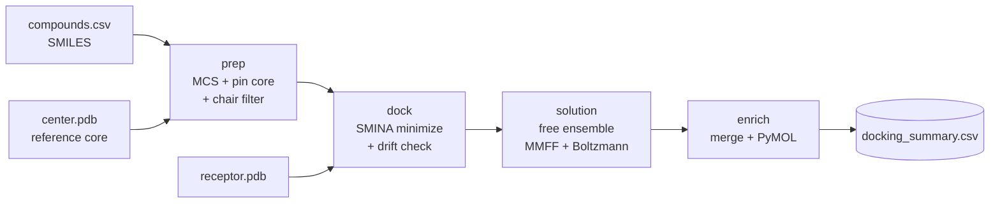

# Constrained SMINA Docking

**Docking put an approved drug 5 Å from where cryo-EM says it binds — and scored the wrong answer 1.5 kcal/mol *better*.**

This repo is a working pipeline for MCS-constrained docking, plus the control experiment that shows why you should run it before trusting a single number your docking software gives you.


---

## The 30-second version

The demo target is **CXCR4 bound to AMD070 (mavorixafor)**, from cryo-EM structure [8ZPM](https://www.rcsb.org/structure/8ZPM) at 3.2 Å. We know exactly where the ligand sits. So we asked SMINA to find it, without help.

It couldn't.

| | RMSD to experimental pose | SMINA affinity |
|---|---|---|
| **Constrained** (this pipeline) | **0.32 Å** | −7.03 |
| Free docking, 5 seeds | 4.62 – 7.15 Å | −7.3 to **−8.5** |
| Experimental pose, scored directly | — (0 by definition) | **−6.99** |

Zero of five runs came within 2 Å. Worse: SMINA scored its own incorrect poses **better** than the real one. The search wasn't lost — it found what it was looking for, and what it was looking for was wrong.

### Why, mechanistically

Mavorixafor is a polyamine. At pH 7.4 it carries **+2**, and in 8ZPM those charged nitrogens are clamped by two acidic residues:

```
Asp97  OD2 ···· ligand N3    2.73 Å
Glu296 OE2 ···· ligand N5    2.62 Å
```

Now look at what SMINA's default scoring function actually contains — printed by SMINA itself on every run:

```
gauss(o=0)   gauss(o=3)   repulsion   hydrophobic   non_dir_h_bond   num_tors_div
```

There is **no electrostatic term**. The interaction that defines this binding mode is invisible to the function being optimised. No amount of exhaustiveness fixes that, and we verified it: 4× exhaustiveness changed the answer by 0.1 Å.

**This is not a bug in SMINA.** It's a documented property of Vina-family scoring, and it bites hardest exactly where medicinal chemists live — charged ligands, acidic pockets, salt-bridge-driven recognition. The fix isn't a better search. It's to stop asking the question.

---

## Two scripts

### `redock_control.py` — run this first, on every new target

Docks your reference ligand freely and compares it to its own experimental pose. Then runs the three controls that separate a real finding from a boring one:

```bash
python redock_control.py -r receptor.pdb -C center.pdb --reference-sdf ligand.sdf
```

```
==============================================================================
VERDICT
==============================================================================
  free redocking             best  4.62 | median  5.23 | worst  7.15 A   recovered 0/5
  control: sampling          best  4.74 | median  4.88 | worst  7.17 A   recovered 0/3
  control: protonation       best  4.60 | median  4.61 | worst  6.90 A   recovered 0/3
  constrained pose           0.32 A

  Free docking did NOT recover the reference pose in any of 5 runs
  (best 4.62 A, threshold 2.0 A).

  The scoring function ranked its own incorrect pose (-8.50) ABOVE the
  experimental pose (-6.99). This is a scoring failure, not a sampling
  failure -- more exhaustiveness cannot fix it. Constrain, and treat
  unconstrained affinities for this target as unreliable.
```

It distinguishes the three outcomes that matter:

| Outcome | Meaning |
|---|---|
| Pose recovered | Constraint is optional. Free docking is defensible here. |
| Not recovered, reference still scores best | **Sampling** failure. Raise exhaustiveness. |
| Not recovered, wrong pose scores better | **Scoring** failure. Constrain, and distrust free scores. |

Costs a few minutes. Determines whether everything downstream is worth reading.

### `constrained_smina_docking.py` — the pipeline

```bash
python constrained_smina_docking.py \
    -i compounds.csv -r receptor.pdb -C center.pdb -o results
```



| Stage | What happens |
|---|---|
| **prep** | Maximum common substructure against the reference, then embed conformers with those atoms pinned to the experimental coordinates. Non-chair saturated 6-rings rejected by Cremer–Pople puckering analysis. |
| **dock** | SMINA on every conformer. Captures both the affinity **and the pose drift** — how far minimisation pulled the ligand off its constrained start. |
| **solution** | Unconstrained conformer ensemble, MMFF energies, Boltzmann populations, RMSD to the docked pose. |
| **enrich** | Merges ensemble statistics into the summary and builds PyMOL sessions. |

---

## Quickstart

```bash
conda env create -f environment.yml
conda activate constrained-docking

# 1. Should you even be constraining?
python redock_control.py \
    -r examples/cxcr4/receptor.pdb \
    -C examples/cxcr4/center.pdb \
    --reference-sdf examples/cxcr4/analog.sdf

# 2. Dock the analogue series
python constrained_smina_docking.py \
    -i examples/cxcr4/compounds.csv \
    -r examples/cxcr4/receptor.pdb \
    -C examples/cxcr4/center.pdb \
    -o results --prune-rms 1.0
```

The bundled example is mavorixafor with an ethyl branch added to its butyl linker — a plausible next analogue, and one where you want the shared scaffold held exactly where cryo-EM put it.

---

## Four things this gets right that most pipelines don't

**1. Protonation is handled where it actually matters — and not where it doesn't.**

`Chem.AddHs()` fills *neutral* valences. It performs no protonation-state assignment. MMFF94 is an all-atom force field, so the solution ensemble, its energies and its Boltzmann populations are only meaningful for the species that really exists at pH 7.4. That's the reason this pipeline assigns one protomer with Open Babel and uses it everywhere — recorded in the output, so it's auditable rather than implicit.

What it is *not* is a lever on the docking score. Measured on identical coordinates:

| | Affinity |
|---|---|
| Ligand, neutral | −5.685 |
| Ligand, +2 dication | −5.723 |
| Receptor, no hydrogens | −6.58261 |
| Receptor, **+2365 hydrogens** | −6.58261 |

Ligand charge state moves the score by 0.04 kcal/mol. Adding hydrogens to the receptor moves it by **exactly nothing**. Both follow from the same limitation behind the redocking failure: no electrostatic term, and an H-bond term that is explicitly `non_dir` — non-directional, keyed off heavy-atom donor/acceptor typing, indifferent to where hydrogens point.

So: **you do not need to protonate the receptor for SMINA.** If you rescore with anything physics-based (MM-GBSA, MD), you absolutely do — but that's that tool's requirement, not this one's. What *would* reach the score at the heavy-atom level is His/Asn/Gln flips; in this structure His289 (3.48 Å) and His113 (4.32 Å) sit close enough to the ligand to be worth checking, and at 3.2 Å their orientations are not always unambiguous in the density.

Open Babel's `-p` is a SMARTS transform table, not a pKa model. When it's wrong, `--protomer-col` pins the species per compound.

**2. Pose drift is measured, not assumed.**

Constrained docking's failure mode is silent: you pin the core, minimisation pulls it off, and you report an affinity for a pose that isn't constrained any more. SMINA reports that drift; this pipeline records it as `pose_rmsd` and can reject on it with `--max-pose-rmsd`.

The default `--smina-minimize-iters 10` came from measuring it:

| `--minimize_iters` | Affinity | Pose drift |
|---|---|---|
| 0 (SMINA's default) | −7.73 | **1.49 Å** |
| **10 (ours)** | −6.58 | **0.50 Å** |
| 100 | −7.58 | 1.31 Å |

SMINA's default drifts furthest. We'd rather keep the constraint than bank a kcal/mol we didn't earn.

**3. RMS pruning measures the atoms that can actually move.**

When the MCS covers most of the molecule, conformers are near-identical. In the demo, 26 of 28 heavy atoms are pinned — only an ethyl is free. Averaged over *all* heavy atoms, a full rotation of that ethyl registers as barely 0.5 Å, so a naive threshold silently does nothing. Pruning here uses only the unconstrained atoms, so `--prune-rms 1.0` means what you think. (24 conformers → 2 genuinely distinct ones, in the demo.)

**4. Reference bond orders are handled honestly.**

A PDB with no CONECT records reads with every bond single. Calling `AddHs` on that inflates a 26-atom aromatic ligand to 67 atoms of nonsense. This pipeline doesn't add hydrogens to the reference at all — it's only used for heavy-atom matching and coordinates — and `--reference-smiles` restores real bond orders when you need strict matching.

---

## Output

```
results/
├── docking_summary.csv          ← the deliverable
├── preparation_summary.csv         protomer, charge, core size per compound
├── conformers/<id>/                constrained conformers (SDF)
├── docking/poses/<id>_best.sdf     best pose
├── docking/logs/                   SMINA logs
├── solution/<id>/                  free ensemble + <id>_energies.csv
└── pymol/docking_overview.pse      receptor + reference + all poses
```

`docking_summary.csv`:

| Column | Meaning |
|---|---|
| `binding_affinity` | SMINA score, kcal/mol |
| `pose_rmsd` | drift from the constrained input — your constraint-fidelity check |
| `Min E` / `Min E RMSD` | lowest-energy solution conformer, and its distance from the bound pose |
| `Nearest E` / `Nearest RMSD` | solution conformer closest to the bound pose, and its energy |

`Nearest E − Min E` approximates a **strain penalty** — how far up the solution energy landscape the ligand climbs to bind. Treat it as a soft, comparative signal, not a measurement. Two reasons, both real:

**It is sampling-dependent.** Both endpoints move as you sample more, and they move in the same direction:

| `--n-solution` | Min E | Nearest E | gap | Nearest RMSD |
|---|---|---|---|---|
| 10 | 79.94 | 98.94 | 19.00 | 1.69 Å |
| 30 | 79.94 | 100.13 | 20.19 | 1.46 Å |
| 60 | 74.90 | 85.18 | **10.28** | 1.29 Å |

More conformers find both a deeper minimum *and* a closer match to the bound pose, and the gap halves. The default of 10 is a demo default, not a production one — use 100+ if you intend to quote strain.

**It is gas-phase MMFF on a +2 dication.** Intramolecular charge repulsion is badly overestimated without solvent, which inflates the apparent penalty. Rerun with `--protonate none` to see how much survives.

Compare these across compounds, never against an absolute threshold.

---

## Key flags

```
--stages prep,dock,solution,enrich    run a subset      --resume    --dry-run
--mode {minimize,local_only,score_only,dock}            minimize is correct for
                                                        pre-positioned poses
--smina-minimize-iters 10             constraint fidelity vs score
--max-pose-rmsd 0.5                   reject poses that broke the constraint
--prune-rms 1.0                       collapse near-duplicate conformers
--protonate {obabel,none}  --ph 7.4  --protomer-col COL
--mcs-smarts SMARTS                   pin a core by hand instead of running MCS
--min-mcs-atoms N                     fail loudly on a weak match
--all-symmetry-matches                try every symmetric mapping, keep the best
--reference-smiles SMI                restore bond orders on a CONECT-less PDB
--chair-filter / --no-                on by default (prep)
--solution-chair-filter / --no-       off by default — see below
```

<details>
<summary><b>Why the chair filter is off for the solution ensemble</b></summary>

Filtering the *constrained* set to chairs is fine: you're oversampling and want physically sensible bound-state candidates.

Filtering the *solution* ensemble is not. Boltzmann populations normalise over the states you kept, so discarding boats and twist-boats truncates the very distribution you're integrating. And if the docked pose happens to sit on a non-chair ring, filtering removes the conformer that actually matched it and silently inflates `Nearest RMSD`.

It's available with `--solution-chair-filter` if you want it. It's just not the safe default.

Note it's also frequently a no-op: it only fires on genuinely saturated 6-rings. A benzo-fused ring has aromatic bonds and is correctly excluded — a half-chair isn't a chair, and the chair/boat dichotomy doesn't apply. The demo molecule triggers nothing.
</details>

---

## Claude Code skill

`.claude/skills/constrained-docking/SKILL.md` ships with the repo. Clone it and Claude Code picks it up automatically.

It encodes the judgment, not just the commands: run the redocking control first, read the three-way verdict correctly, treat protonation as global, quote pose drift alongside every affinity, and flag the gas-phase caveat before anyone quotes a strain number.

```
> dock these analogues against the CXCR4 structure
```

---

## Install & test

```bash
conda env create -f environment.yml && conda activate constrained-docking
python test_smoke.py
```

`test_smoke.py` runs in seconds and skips cleanly without SMINA, so it's CI-friendly. It's not decorative — it exists because of a bug that shipped silently:

RDKit's `coordMap` constrains a molecule's *internal* geometry but leaves it in an arbitrary frame, typically centred on the origin — around **230 Å** from a receptor-frame reference. Nothing raises. (RDKit's own `AllChem.ConstrainedEmbed` has the same wrinkle and fixes it the same way, by aligning onto the core afterwards.) Compounding it, `useRandomCoords=True` with a `coordMap` returns **zero** conformers on RDKit ≥2024 while working on 2023.09 — where it also happened to return conformers already in the right frame, hiding the first problem entirely.

Verified on Python 3.8/RDKit 2023.09 and Python 3.13/RDKit 2025.09: 26/26 tests pass, and the pipeline lands the docked pose 0.32 Å from the crystal core on both.

Needs SMINA, RDKit, Open Babel, pandas, numpy. PyMOL is optional — sessions are always written as `.pml`, and rendered to `.pse` if a PyMOL binary is reachable. The scripts stay Python 3.8 compatible so they run inside a SMINA conda environment directly, and they auto-discover `smina`, `obabel` and `pymol` on `PATH` or in nearby conda environments.

---

## Provenance & citing

**`examples/cxcr4/8ZPM.cif` is the deposited structure, bundled** so every docking input can be traced to its source. [8ZPM](https://www.rcsb.org/structure/8ZPM) is CXCR4 with the antagonist AMD070, cryo-EM at 3.2 Å. Its `atom_site` loop contains four things:

| In the cif | Atoms | Becomes |
|---|---|---|
| chain R, polymer — BRIL–CXCR4 fusion, residues 34–315 | 2292 | `receptor.pdb` |
| chain R, `A1D8L` — **Mavorixafor**, named as such in the cif | 26 | `center.pdb` |
| chain N, polymer — Nb6 nanobody | 848 | dropped |
| chain R, `CLR` — cholesterol ×2 | 56 | dropped |

Both PDB files are the deposited coordinates verbatim — all 2292 and all 26 atoms match to <0.005 Å. The two dropped components are nowhere near the site: the nanobody is 32.9 Å from the ligand and cholesterol 15.0 Å, with **zero atoms of either within 8 Å**. No hydrogens are modelled at 3.2 Å (the file contains only C, N, O, S), which is fine — see above for why the receptor doesn't need them.

- **Ligand**: AMD070 / mavorixafor, an approved CXCR4 antagonist. `examples/cxcr4/analog.sdf` is a modelled ethyl analogue, not experimental.
- **Structure paper**: Please cite the depositors if you use this data — "Structural mechanisms underlying the modulation of CXCR4 by diverse small-molecule antagonists", *Proc. Natl. Acad. Sci. USA* 2025, 122, e2425795122. [doi:10.1073/pnas.2425795122](https://doi.org/10.1073/pnas.2425795122)
- **Docking**: SMINA — Koes, Baumgartner & Camacho, *J. Chem. Inf. Model.* 2013, 53, 1893. Built on AutoDock Vina — Trott & Olson, *J. Comput. Chem.* 2010, 31, 455.
- **Ring puckering**: Cremer & Pople, *J. Am. Chem. Soc.* 1975, 97, 1354.
- **RDKit**: https://www.rdkit.org

Every number in this README was produced by the two scripts in this repo on the bundled example data. `redock_control.py` reproduces the headline result.

## Scope

The redocking result is one ligand against one target. It is a demonstration that this failure mode is real and worth testing for — not a claim about docking in general. That's the whole point of shipping the control script: **run it on your target instead of assuming either way.**

MIT licensed.
